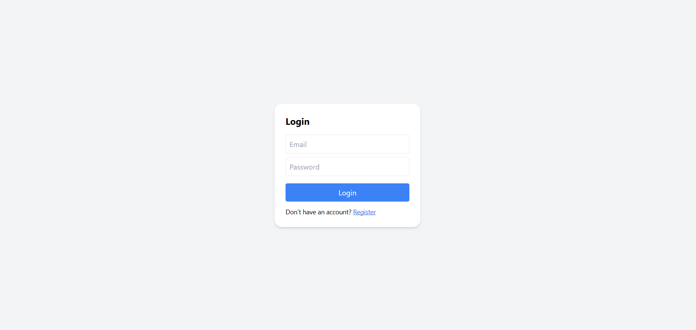
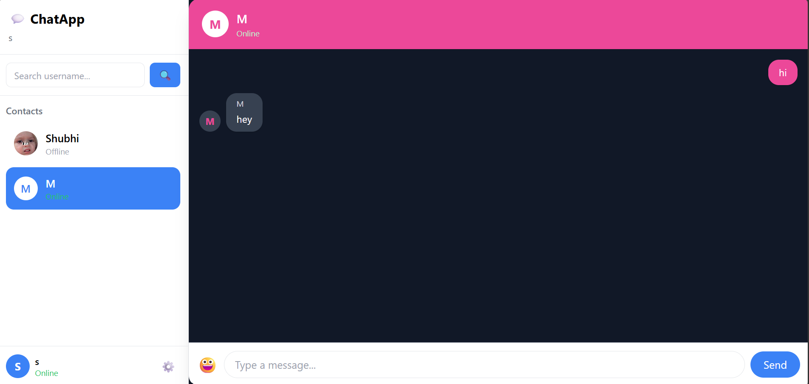
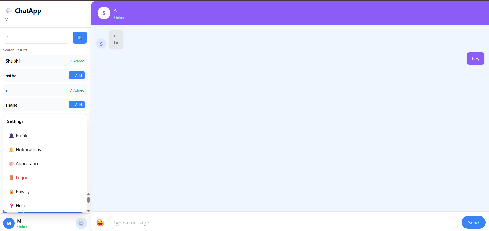

# 💬 Real-Time Chat Application

A full-stack real-time chat application built using the **MERN stack** with **Socket.IO** for instant communication. The application supports secure authentication, one-to-one messaging, friend requests, online user tracking, and a responsive chat interface.

## ✨ Features

* 🔐 **User Authentication** — Registration and login with JWT authentication and bcrypt password hashing
* 💬 **Real-Time Messaging** — Instant one-to-one messaging using Socket.IO
* 👥 **Friend Management** — Search users, send friend requests, and accept/decline requests
* 🟢 **Online Status** — Real-time tracking of online users
* 💾 **Message Persistence** — Chat messages stored in MongoDB
* 👤 **User Profiles** — Profile information and profile pictures
* 😊 **Emoji Support** — Send messages with an integrated emoji picker
* 📱 **Responsive UI** — Modern chat interface built with React and Tailwind CSS

## 🛠️ Tech Stack

**Frontend**

* React.js
* Tailwind CSS
* Axios
* Socket.IO Client
* Framer Motion
* Lucide React

**Backend**

* Node.js
* Express.js
* Socket.IO
* MongoDB
* Mongoose
* JWT
* bcrypt.js

**Tools**

* Git & GitHub
* VS Code
* Nodemon

## 🏗️ Architecture


                   ┌─────────────────┐
                   │  React Frontend │
                   │                 │
                   │ Login/Register  │
                   │ Sidebar         │
                   │ Chat Window     │
                   │ Profile         │
                   └────────┬────────┘
                            │
                    REST API + Socket.IO
                            │
                            ▼
                   ┌─────────────────┐
                   │ Node + Express  │
                   │                 │
                   │ Authentication  │
                   │ Users/Friends   │
                   │ Messages        │
                   │ Socket Server   │
                   └────────┬────────┘
                            │
                            ▼
                   ┌─────────────────┐
                   │     MongoDB     │
                   │                 │
                   │ Users           │
                   │ Messages        │
                   │ Friends         │
                   └─────────────────┘
```

## 📁 Project Structure

```text
chat-app/
│
├── client/
│   ├── public/
│   └── src/
│       ├── Component/
            |──Appearance.js
│       │   ├── ChatWindow.jsx
│       │   ├── Login.js
│       │   ├── MessageBubble.js
│       │   ├── MessageInput.js
│       │   ├── Profile.js
│       │   ├── Register.js
│       │   └── Sidebar.js
│       ├── App.js
│       └── index.js
│
├── server/
│   ├── middleware/
│   │   └── authMiddleware.js
│   ├── models/
│   │   ├── User.js
│   │   └── Message.js
│   ├── routes/
│   │   ├── authRoutes.js
│   │   └── messageRoutes.js
│   └── server.js
│
├── .gitignore
└── README.md
```

## 🚀 Getting Started

### Prerequisites

Make sure you have installed:

* Node.js
* npm
* MongoDB / MongoDB Atlas
* Git

### 1. Clone the repository

```bash
git clone https://github.com/shubhangi968/chat-app.git
cd chat-app
```

### 2. Setup Backend

```bash
cd server
npm install
```

Create a `.env` file inside the `server` directory:

```env
PORT=5000
MONGO_URI=your_mongodb_connection_string
JWT_SECRET=your_jwt_secret
```

Start the backend:

```bash
npm run dev
```

The server will run on:

```text
http://localhost:5000
```

### 3. Setup Frontend

Open a new terminal:

```bash
cd client
npm install
npm start
```

The frontend will run on:

```text
http://localhost:3000
```

## 🔐 Authentication Flow

The application uses **JWT-based authentication**.

```text
Register
   ↓
Password hashed with bcrypt
   ↓
User stored in MongoDB
   ↓
Login
   ↓
JWT generated
   ↓
Protected API & Socket.IO access
```

Protected backend routes require a valid authentication token.

## ⚡ Real-Time Communication

**Socket.IO** is used for real-time features such as:

* Instant message delivery
* Online/offline user status
* Chat room communication
* Friend-request notifications

Messages are persisted in MongoDB while Socket.IO handles real-time delivery between connected users.

## 📸 Screenshots

### Login



### Chat Interface

 


## 🔮 Future Improvements

* Typing indicators
* Message read receipts
* Message editing and deletion
* Image/file sharing
* Group chats
* Push notifications
* Voice/video calling
* Message search

## 👩‍💻 Author

**Shubhangi Agrawal**

Computer Science Engineering Student

